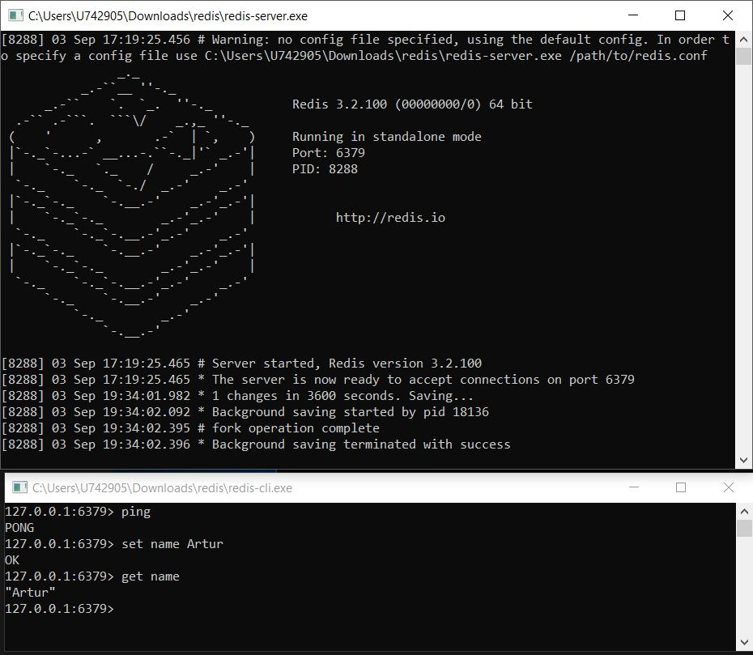
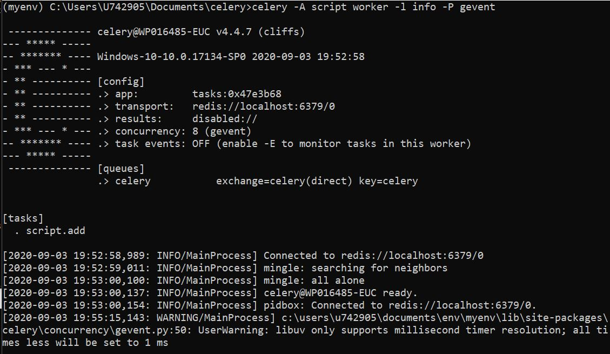
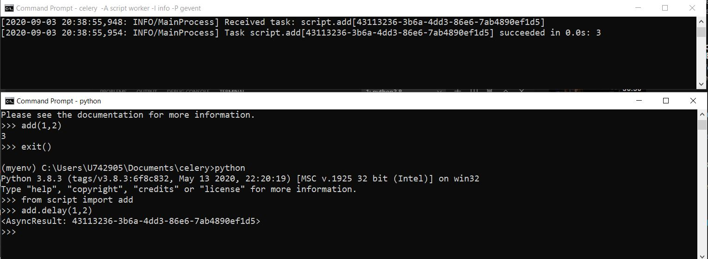

<h2>Asynchronous Execution with Celery and Python</h2>

"Outsourcing" time-consuming functions for the exectution in the background of normal app's work so that app can continue its programmed routine.

<ul>
  <li>Units that are going to be executing outsourced task are called <b>workers</b>.</li>
  <li>Tasks generated by client application are going to be stored in the messague queue of a task broker.</li>
</ul>

<h3>Celery Architecture</h3>
<ul>
  <li>client app --> message queue in taks broker --> worker --> result storage --> client</li>
   
  
  <li>The data result storage generates the task ID so that client can track its status.</li>
  <li>In order to pass a function to the celery, the only thing you need to do is to put the decorator '@app.task' above the function.</li>
  <li>For tasks broker I can choose Heroku or Redits</li>
</ul>

<h3>Redis as Broker on Windows</h3>
<ul>
  <li><i>In-memory data structure store, used as a database, cache and message broker.</i></li>
  <li>Redis stores data as key-value pairs where value is actual data.</li>
  <li>Running server with redis-server.exe</li>
   
  
</ul>

<h3>Running Celery server on Windows</h3>
<ul>
  <li>pip install celery</li>
  <li>pip install gevent</li>
  <li>celery -A script_name worker -l info -P gevent</li>
   
  
</ul>

<h3>Python</h3>
<ul>
  <li>Function_name.delay(x,y) - with .delay() python sends function to the tasks queue so that celery can execute it.</li>
  <li>The task id is returned.</li>
  <li>Celery notifies task reception and its outcome.</li>
   
  
</ul>
